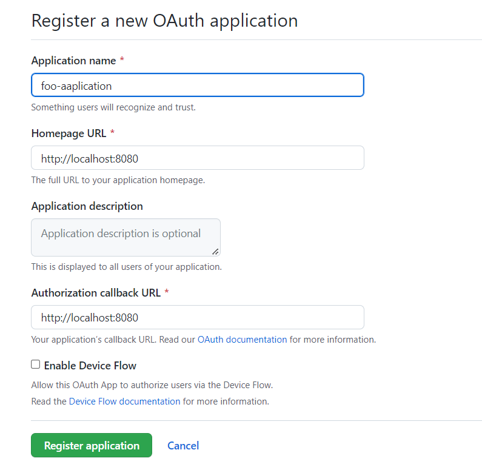
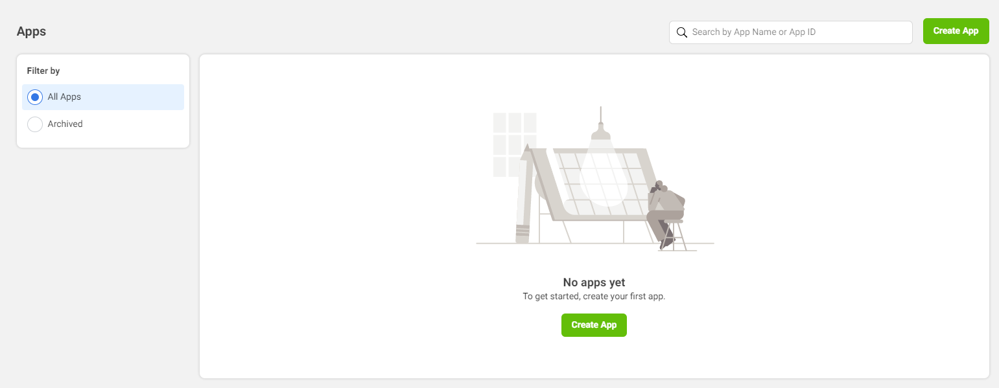
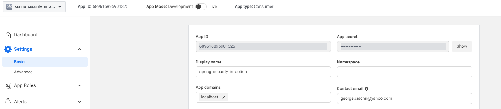

# Register app with common auth providers for setting up an Oauth2 flow 

## Github app creation and registration
Access https://github.com/settings/applications/new
After creating the app get the client id and the secret and add them to the ClientRegistration object
For future reference, you'll find the application here: https://github.com/settings/developers
Additional info: https://docs.github.com/en/developers/apps/building-oauth-apps/authorizing-oauth-apps

*************************************************************************************************

## Facebook app creation and registration
Access https://developers.facebook.com/apps/

After creating the app get the client id and the secret and add them to the ClientRegistration object

