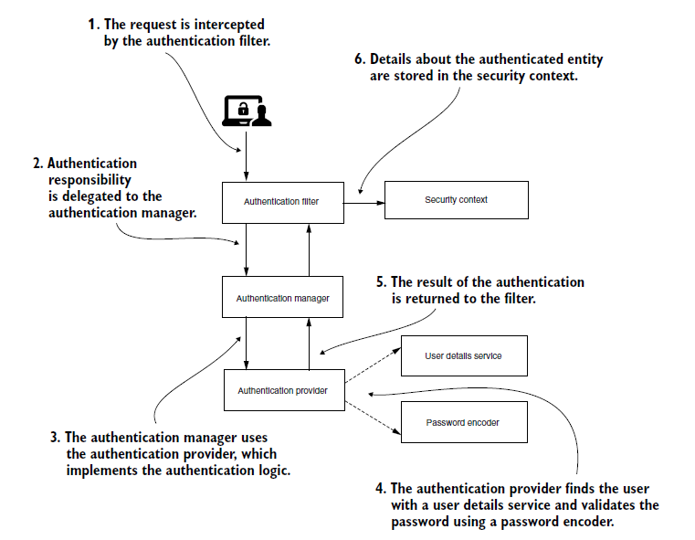

# First simple app

When spring-security is added, basic auth is automatically added and all endpoints get secured.
- Grab the password from the logs -> the UUID
- The user is -> user

Then
curl -u user:psw http://localhost:8080/hello

Or run the [hello-controller.http](http-requests/hello-controller.http) requests with the [http-client.env.json](http-requests/http-client.env.json)

## Setting up https

Note for me: When asked for a password use a dummy password, not an actual password, because it will get exposed on git 

1. Generate a certificate and a signing key
    `winpty openssl req -newkey rsa:2048 -x509 -keyout key.pem -out cert.pem -days 365`

2. Sign the certificate
    `winpty openssl pkcs12 -export -in cert.pem -inkey key.pem -out certificate.p12 -name "certificate"`