## Define a tenant

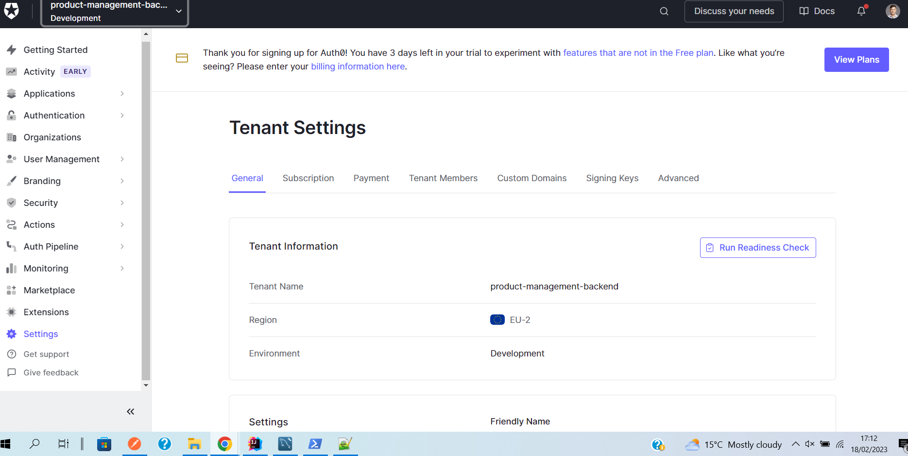

## Define an API (this is the resource server representation)

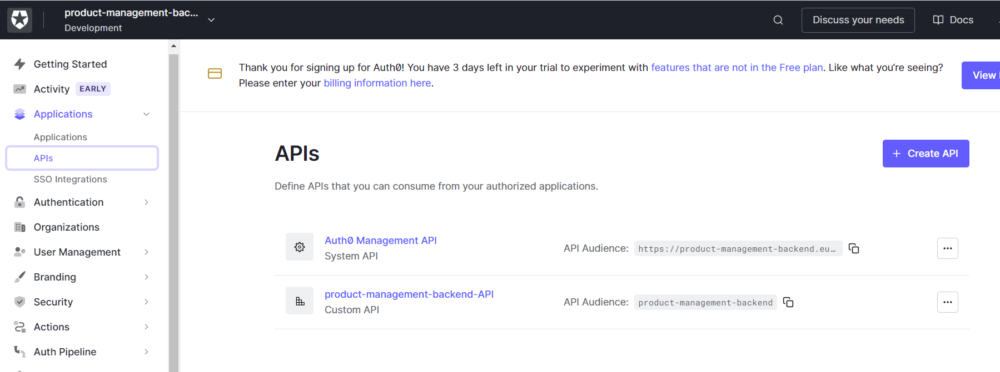

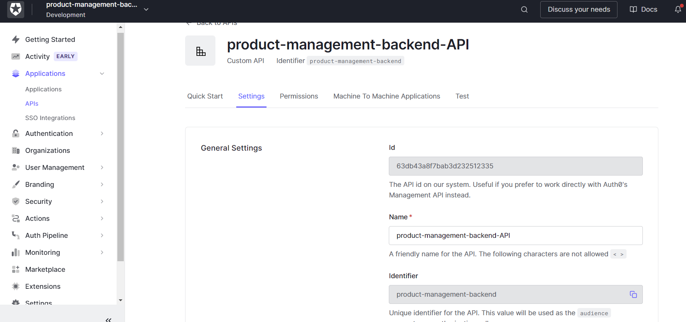

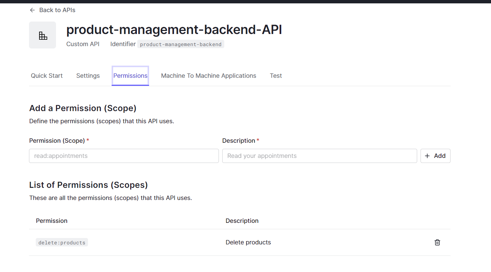

## Define applications that will access the api (these are the clients of the api)
Note that for the resource server to be able to offer login capabilities, it also needs to be registered here as 
a client of the api.

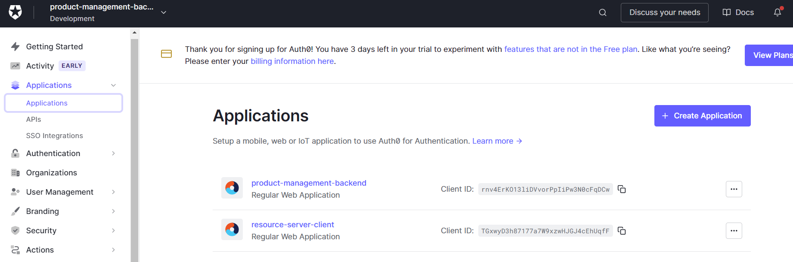

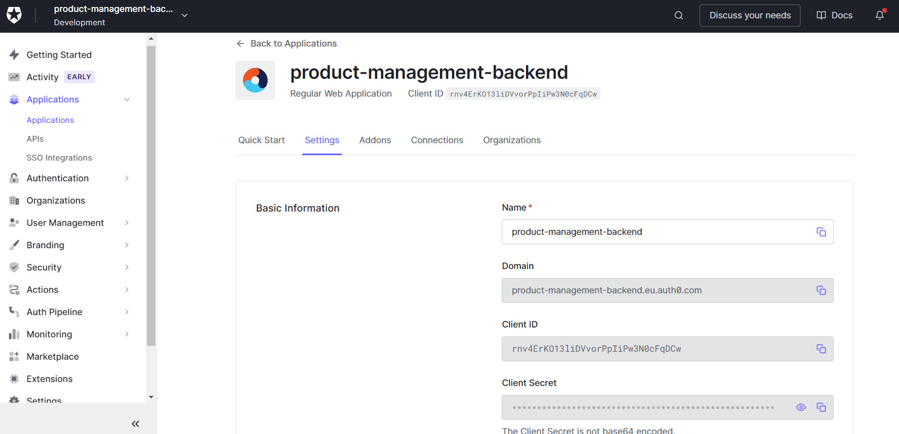

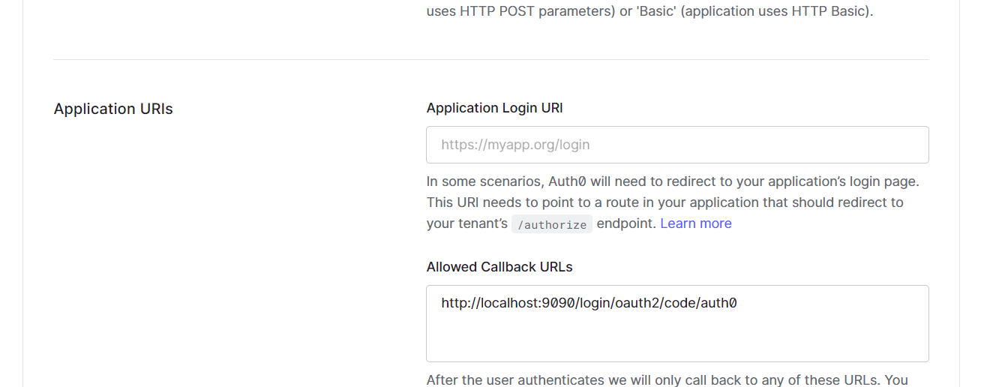

## Create roles for the user

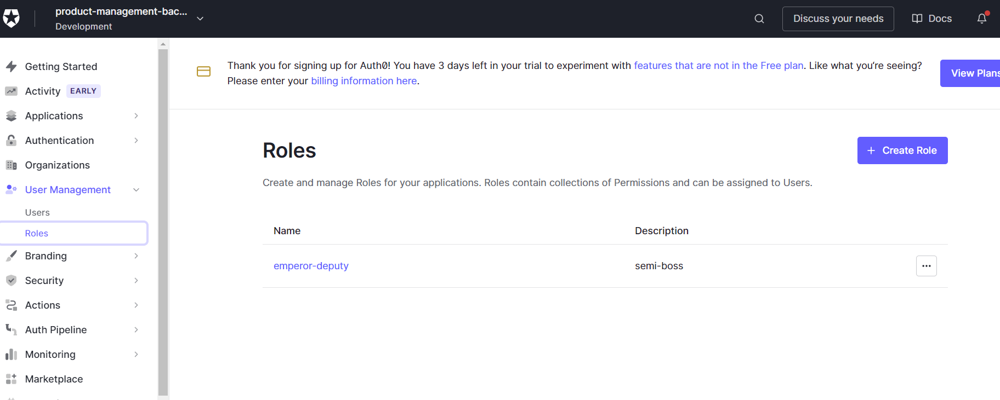

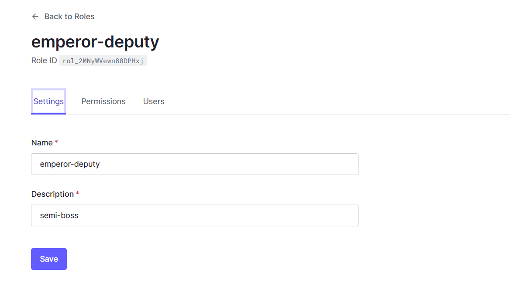

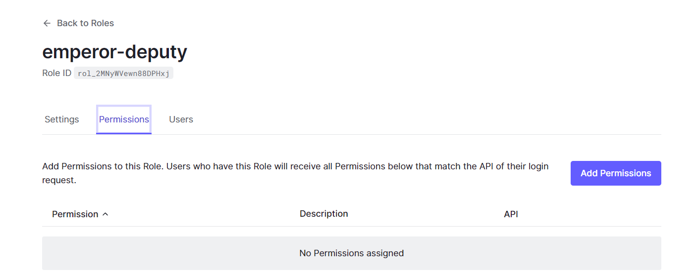

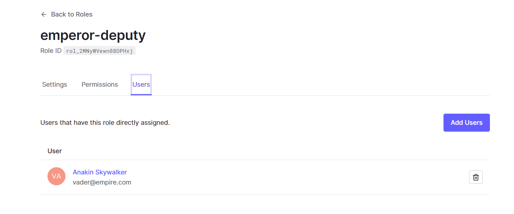

## Create users

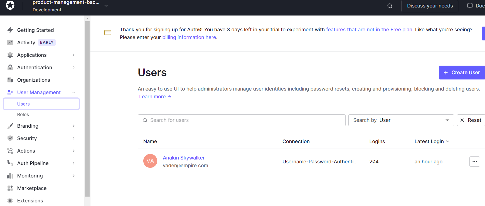

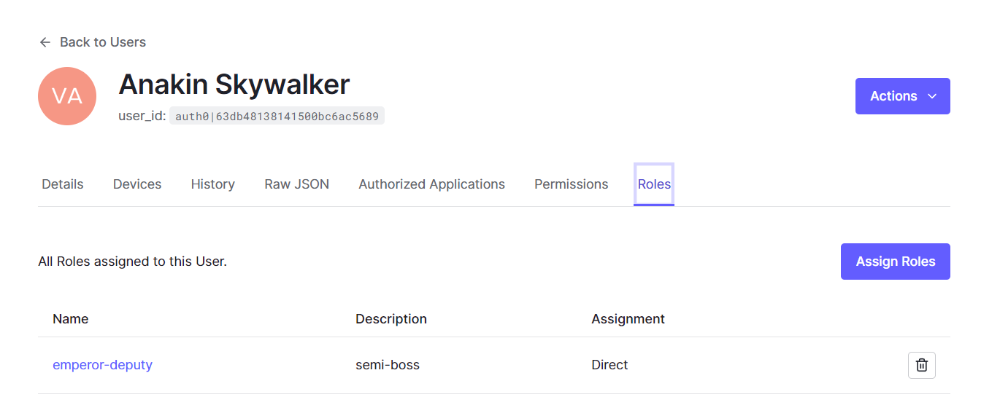

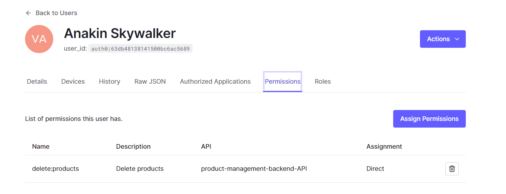

## Add additional claims
You can add more claims to the token (similar to the keycloak token mappers)

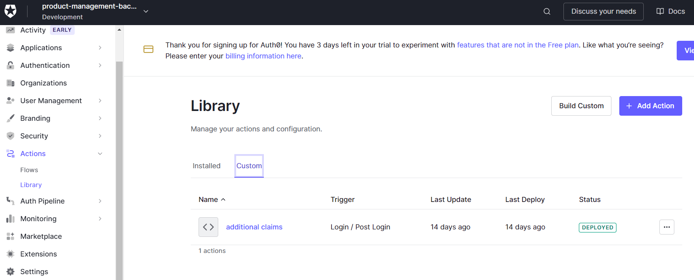

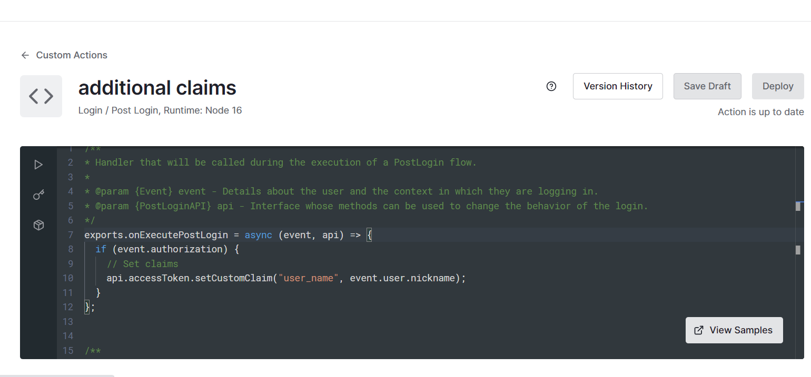