# Keycloak setup

For the RS I have also configured keycloak to use GitHub as a third party provider
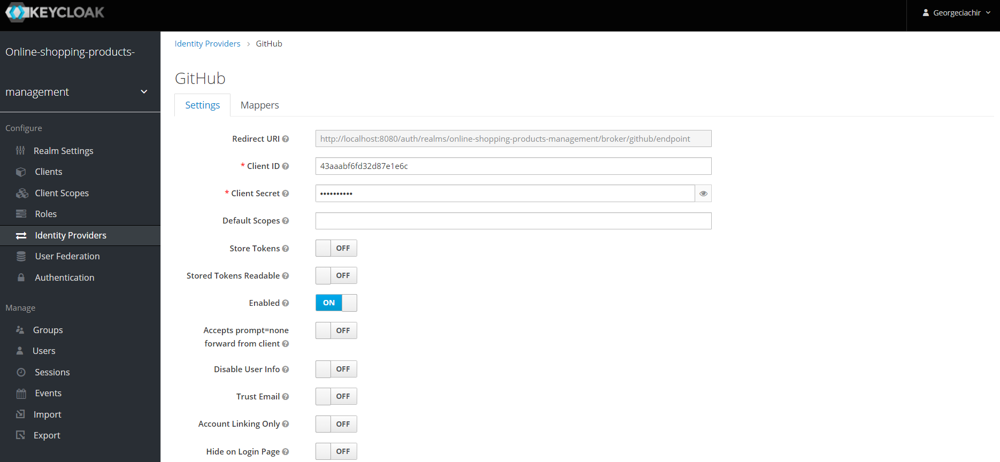

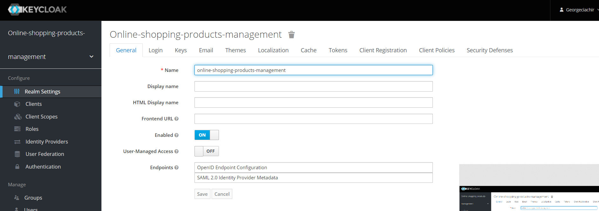

## Defining a scope

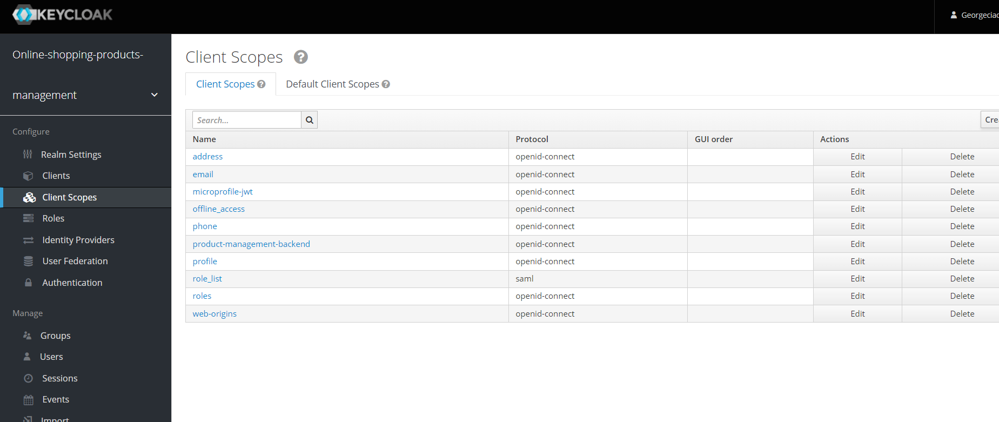

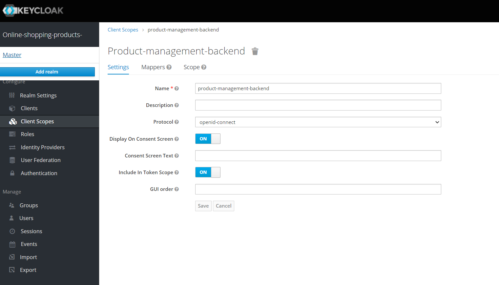

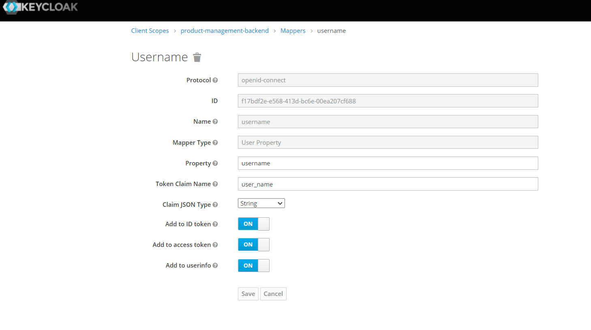

## Defining a client

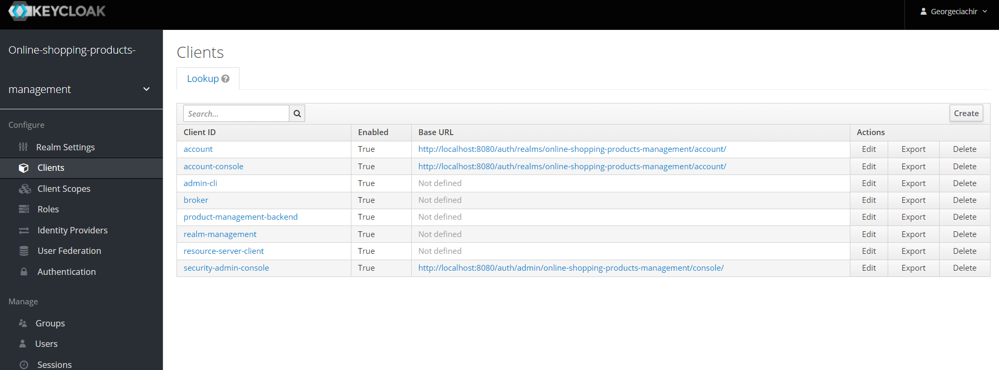

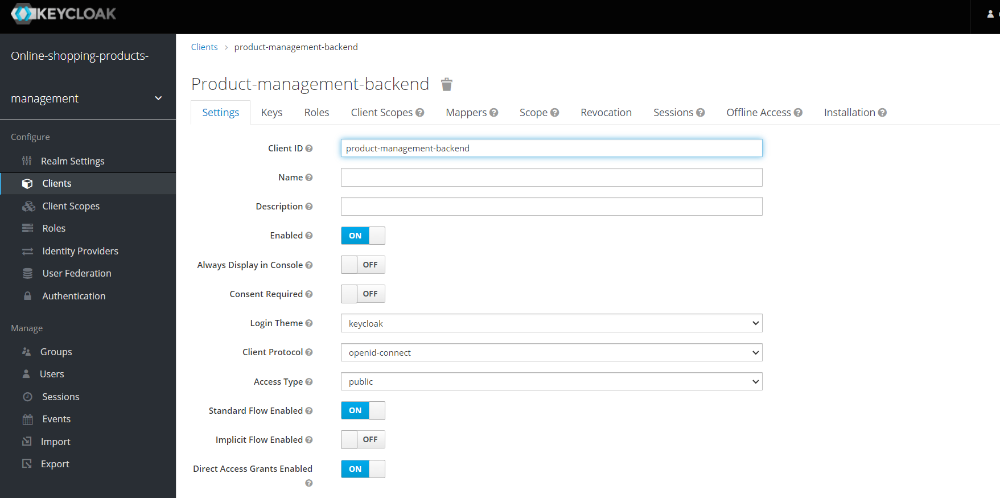

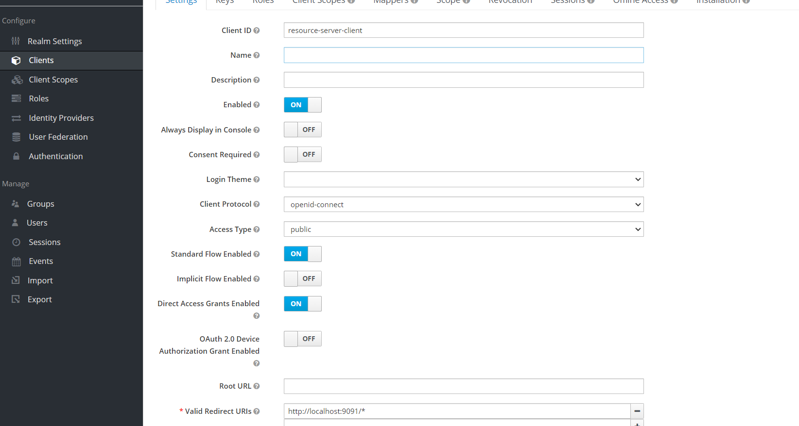

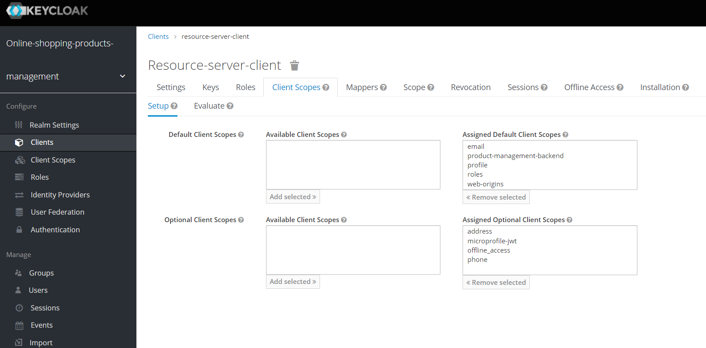

## Defining user roles

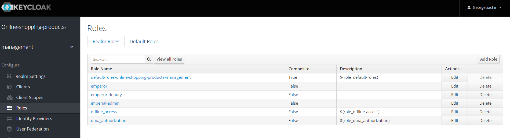

## Define users

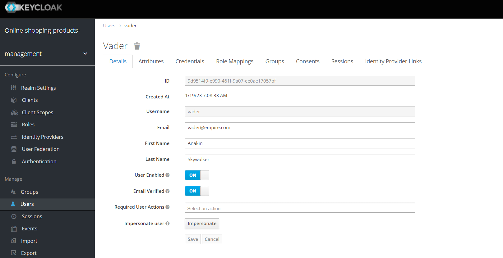

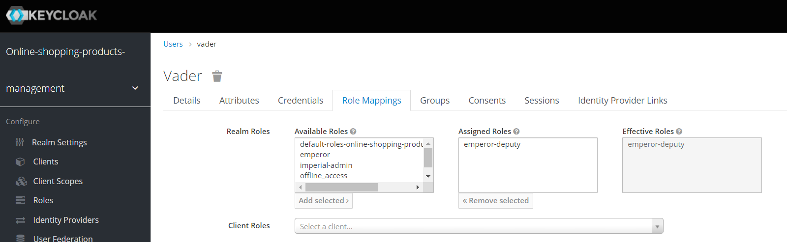