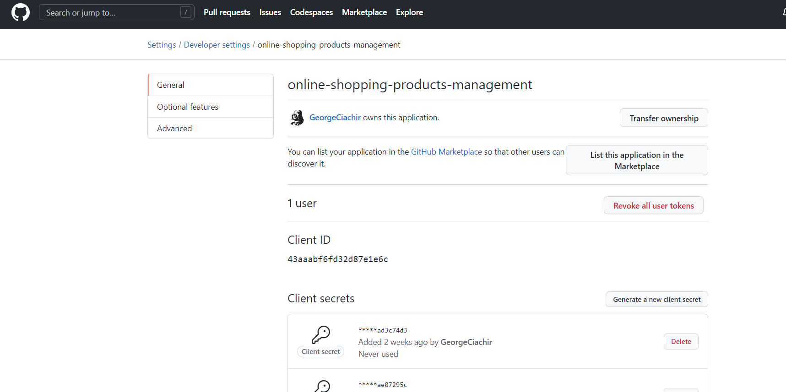

# High level project description

This is a complete setup that includes the Client, the Resource server and several Authorization servers.
The setup is simple:

The Client can be called on localhost:9091/hello, it prompts the user tp login, obtains a JWT and with this JWT then
calls the Resource server which is running on localhost:9090/hello and just returns th RS response.
The RS accepts JWT login. The RS also provides the possibility to login via a login page with multiple auth servers.

Worth mentioning that because of how the Spring OAuth2 server works, the redirect_uri cannot be localhost. We can use 127.0.0.1.
This means that for logging in with the Spring auth server, because of a session cookie that needs to be set on the redirect_uri,
we need to access both the Client or the Resource server on 127.0.0.0:9091/hello -> Client or 127.0.0.0:9090/hello -> RS

For the authorization servers, I decided to:
1. implement a Spring OAuth2 authorization server running on localhost:9092
2. configure a Keycloak server locally, running on localhost:8080
3. configure an Auth0 project at https://auth0.com/
4. configure GitHub authentication

Client login page:

Resource server login page:

# Obtain JWTs using the authorization code flow

In the [http-requests dir](http-requests) you can find some Intellij http requests flows that can be used to obtain the 
JWT from all 3 auth servers using the authorization code flow with PKCE and one http requests file to call the resource server.

# GitHub setup
https://github.com/settings/developers

# Keycloak setup

For the RS I have also configured keycloak to use GitHub as third party provider

## Defining a scope

## Defining a client

## Defining user roles

## Define users

